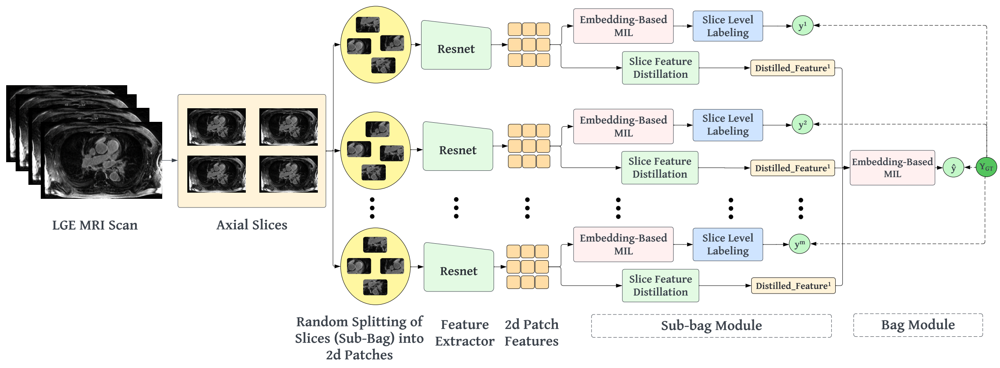

# HAMIL-QA: Hierarchical Attention-based Multiple Instance Learning for Quality Assessment

This repository contains the source code for the paper: [HAMIL-QA: Hierarchical Approach to Multiple Instance Learning for Atrial LGE MRI Quality Assessment (MICCAI 2024)](https://link.springer.com/chapter/10.1007/978-3-031-72378-0_26) to be presented in [MICCAI 2024](https://link.springer.com/book/10.1007/978-3-031-72378-0).

## Overview



This project implements a two-tier attention mechanism for medical image quality assessment:
- **Tier 1**: Patch-level feature extraction using ResNet encoder with attention
- **Tier 2**: Bag-level aggregation with attention for final quality prediction

The model uses pseudo-bags created from extracted patches to perform quality assessment in a multiple instance learning framework.

## Project Structure

```
HAMIL-QA/
├── main.py                      # Main training script
├── config.py                    # Configuration settings
├── model/
│   └── qc_model.py             # Model architectures
├── scripts/
│   ├── qc_trainer.py           # Training logic
│   └── qc_dataset.py           # Dataset handling
├── util/
│   ├── data_transforms_config.py
│   ├── transformation_utils.py
│   └── early_stopping.py
└── model/saved_models/         # Saved model checkpoints
```

## Dataset Structure

### Directory Organization

Your dataset should be organized as follows:

```
/path/to/dataset/
├── UTXYZ/
│   ├── data.nrrd              # Medical image (LGE MRI)
│   └── shrinkwrap.nrrd        # Left atrium segmentation mask
├── UTYZX/
│   ├── data.nrrd
│   └── shrinkwrap.nrrd
├── UTZXY/
│   ├── data.nrrd
│   └── shrinkwrap.nrrd
└── ...
```

**Requirements:**
- Each subject folder contains:
  - `data.nrrd`: The medical image file (NRRD format)
  - `shrinkwrap.nrrd`: The corresponding left atrium segmentation mask
- Folder names should match the subject IDs in the quality labels JSON

### Quality Labels JSON Format

Create a JSON file containing quality assessment labels for each subject:

```json
{
  "UTXYZ": {
    "label": {
      "quality_for_fibrosis_assessment": 5.0
    }
  },
  "UTYZX": {
    "label": {
      "quality_for_fibrosis_assessment": 3.0
    }
  },
  "UTZXY": {
    "label": {
      "quality_for_fibrosis_assessment": 1.0
    }
  }
}
```

**Label Definition:**
- `quality_for_fibrosis_assessment`: Quality score ranging from 1 to 5
  - **1-2**: Poor quality (converted to class 0)
  - **3-5**: Good quality (converted to class 1)

The model automatically converts these scores to binary labels:
- Scores ≤ 2.0 → Class 0 (Poor)
- Scores > 2.0 → Class 1 (Good)

### Configuration Setup

Update `config.py` with your dataset paths:

```python
'data_path': '/path/to/your/dataset',
'qc_label_dict': '/path/to/your/quality_labels.json',
```

## Requirements

```bash
pip install torch torchvision 
pip install monai
pip install timm
pip install pynrrd
pip install Pillow
pip install torchmetrics
pip install scikit-learn
pip install comet-ml # Optional, for experiment tracking
pip install numpy pandas tqdm matplotlib
pip install python-dotenv  # For environment variables
```

## Environment Setup

1. **Create a `.env` file** in the project root: (Optional, for Comet.ml integration)

```bash
# .env
COMET_API_KEY=your_comet_api_key_here
PROJECT_NAME=your_project_name
COMET_WORKSPACE=your_workspace_name
```

2. **Load environment variables** (already configured in `main.py`): 

```python
import os
from dotenv import load_dotenv

load_dotenv()  # Load from .env file
```

## Configuration

Edit `config.py` to customize:

- **Model Parameters**:
  - `n_patches`: Number of patches to extract
  - `no_of_pseudo_bags`: Number of pseudo bags
  - `patch_size_2d`: Size of each patch
  - `overlap_percentage`: Patch overlap 
  - `enlarge_xy`: Enlargement of bounding box
## Running Experiments

### Basic Training

```bash
python main.py
```

### Training with Custom Parameters

```bash
python main.py \
  --learning_rate 1e-4 \
  --batch_size 4 \
  --epochs 500 \
  --no_of_pseudo_bags 4 \
  --n_patches 20
```
## Disable Comet Logging

To run without Comet.ml logging:

```python
# In config.py
disable_comet = True
```

## Citation

If you use this code, please cite:

```bibtex
@inproceedings{sultan2024hamil,
  title={HAMIL-QA: Hierarchical Approach to Multiple Instance Learning for Atrial LGE MRI Quality Assessment},
  author={Sultan, KM Arefeen and Hisham, Md Hasibul Husain and Orkild, Benjamin and Morris, Alan and Kholmovski, Eugene and Bieging, Erik and Kwan, Eugene and Ranjan, Ravi and DiBella, Ed and Elhabian, Shireen},
  booktitle={International Conference on Medical Image Computing and Computer-Assisted Intervention},
  pages={275--284},
  year={2024},
  organization={Springer}
}
```